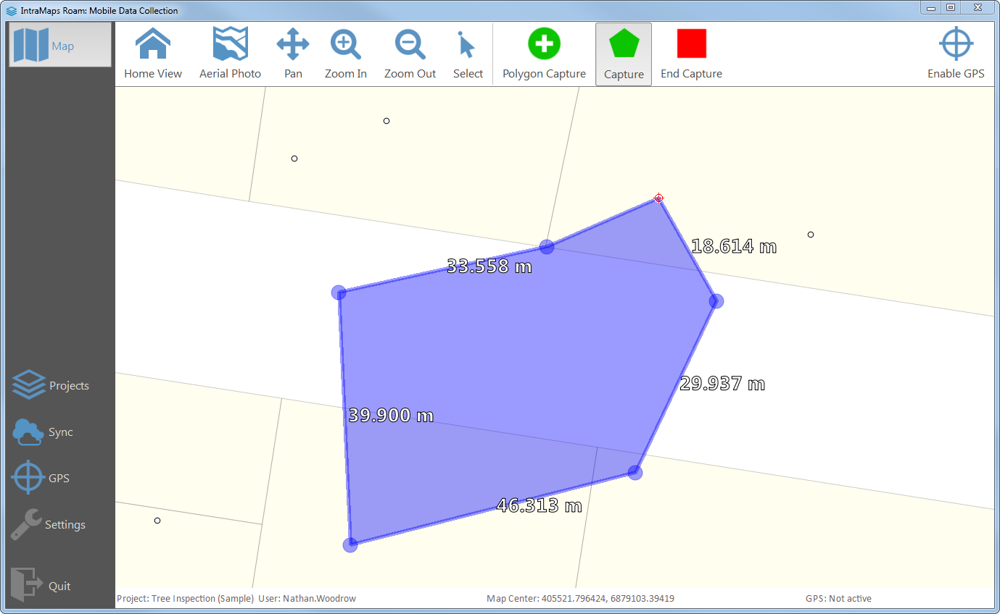
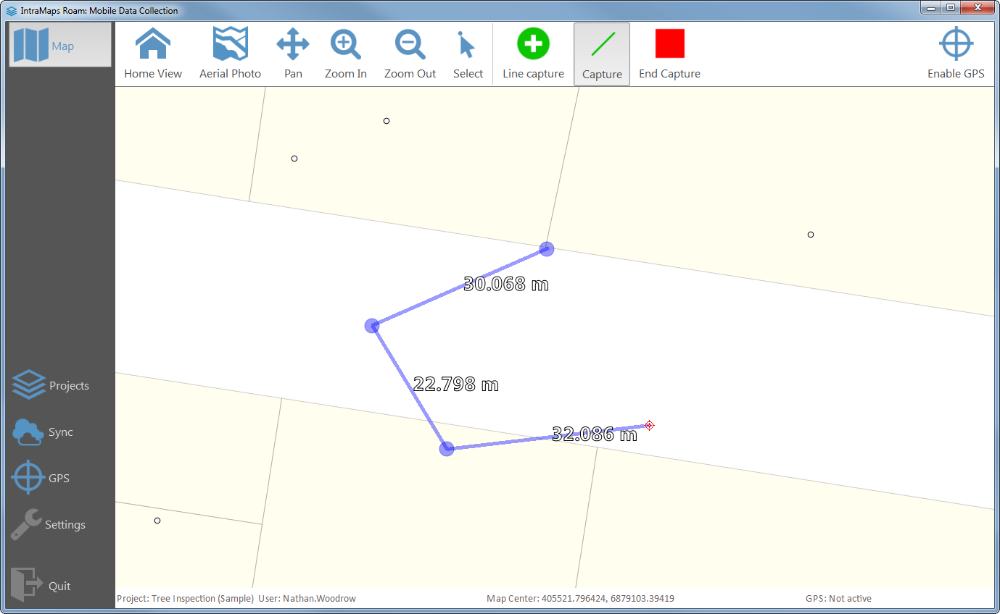
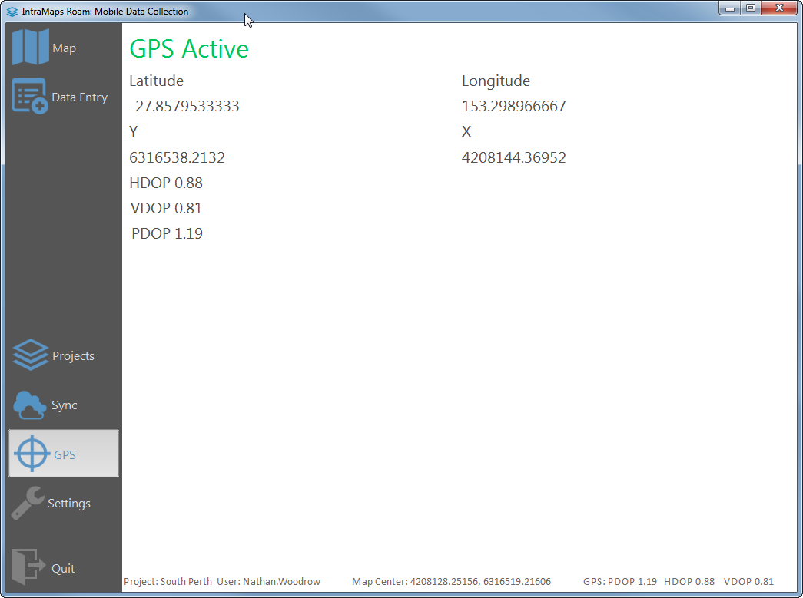
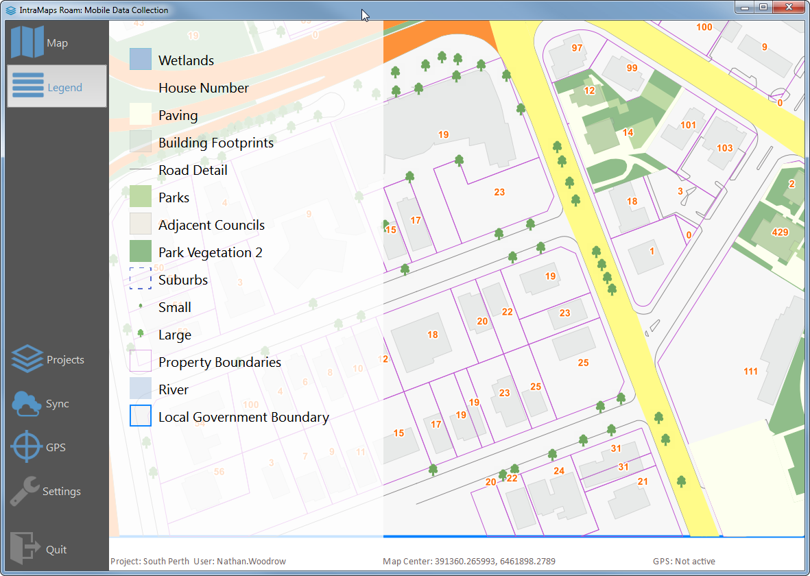
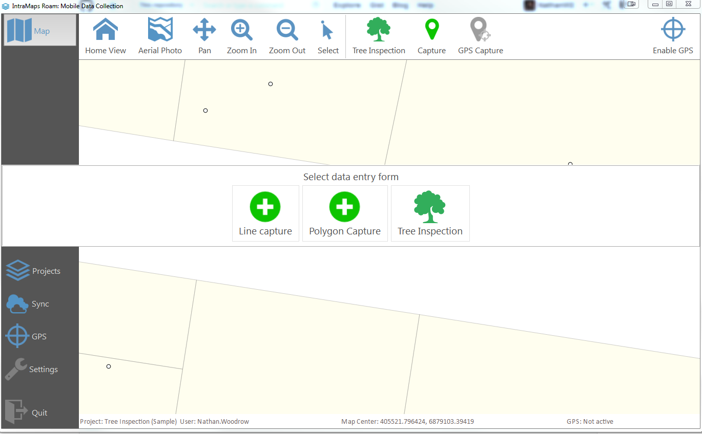
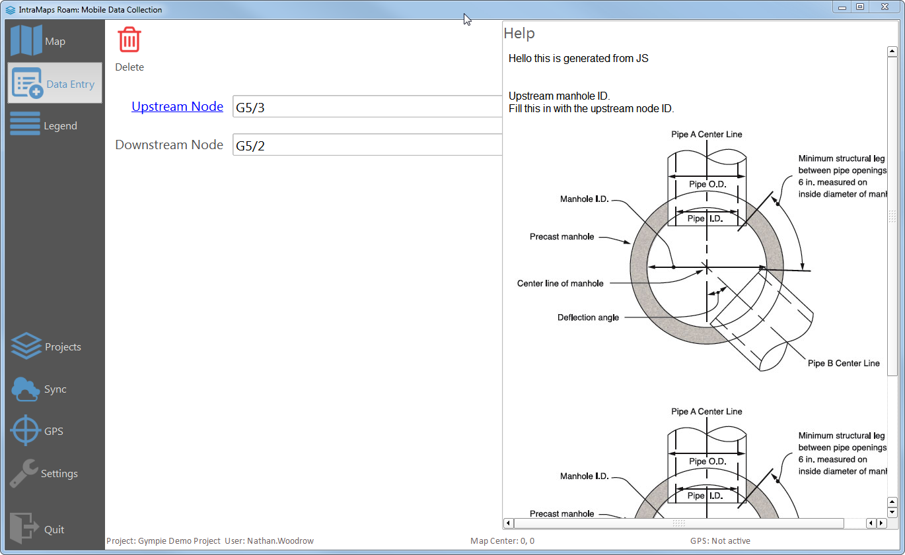
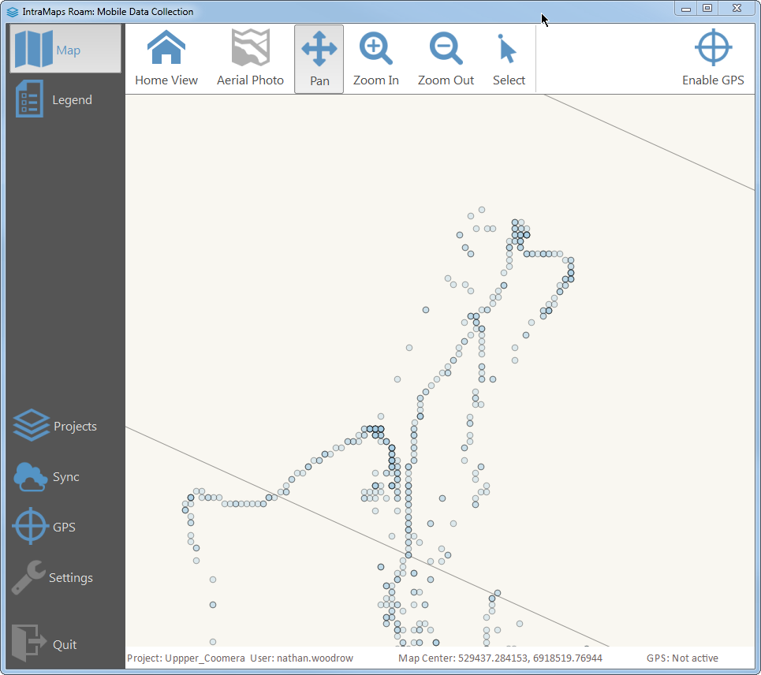

List of new features and changes in IntraMaps Roam 2.1

[Release Files](https://github.com/DMS-Aus/Roam/releases/tag/v2.1)

# Major Features

- Polygon and line capture support
- Recapture geometry
- Drawing pad
- Camera (Windows only)
- GPS page
- Translation support
- API clean up and extras (access to GPS on forms etc)
- Legend page
- Attribute Help
- GPS Logging and tracking
- New `roam.api` module for public facing API.  Anything imported from this module will have stable API in 2.x releases.
- Loading projects from other folders

# Minor Changes
- New action picker banner.
- Form selected replaced with button
- Blue GPS marker.
- Replace old PNG icons with new SVG blue set.
- New icons for config manager
- Each `settings.config` file has now been renamed to match the settings name.  `form.config`, `roam.config`, `project.config`.  *Old settings.config method will continue to work after update*

# Major Features

## Poylgons and lines
Polygon and line capture is now possible. The capture tool will swap to point/line/polygon depending on the layer geometry type.




The lines also have a handy distance marker that will update in real time to show you how long the segment is.

## Drawing pad
The image widget has been expanded to support a new drawpad input mode.  The drawing pad allows for free hand text, and the ability to annotate images and a snapshot of the current map view.


## Camera
Camera integration has been added into image widget.  Images from the camera can also be annotated using the drawing pad.


## GPS page
Basic GPS information is now exposed on the GPS page on the sidebar. *DOP values are also shown in the status bar for aiding data collection.




## Translation support
Roam can now load Qt translation files from the i18n folder. Pull requests welcome for translations.

## Legend
Roam now includes a legend page for viewing a simple auto generated legend from the map.



Adding 

```
legendlayers:
- layer1
- layer2
- layer3
```
to the project.config controls which layers are shown.  If this is not found all layers are shown. *Note*: Only vector layers.

## New action picker banner.
Roam now sports a new action picker panel that lists actions that can be taken at the time.  The panel is used for picking a form as well as selecting a image source.


## Form selected replaced with button
The form selection dropdown has been replaced with a tool button so it fits in the overall UI better.  The list view has been replaced with the new action picker banner.



## Linux support
Roam can be run from source on Linux using the `./build_linux.sh & ./run_linux.sh` command.  Linux support is only new and might need some tweaks to add better support. Tested only on Ubuntu 10.10.

## Attribute Help
Attributes in Roam forms can now have a hyper link that opens a help panel with custom help for the attribute.



Help files are auto linked using `{fieldname}.html` convention from the `{formfolder}/help` folder.

Full HTML and Javascript support.

Relative paths work for loading images:

`<a href="./Fig14.jpg"></a>`

## GPS Logging and tracking

GPS logging and tracking can be enabled by having a writeable layer named `gps_log` in your project file. This file can be anything QGIS can write. Each GPS position will be saved to layer. GPS information will also be saved to the layer when given the right field names.  

Auto field name mapping supports the following:
`x, y, z, user, localtime, latitude, longitude, elevation, speed, direction, pdop, vdop, hacc, vacc, time, fixMode, fixType, quality, satellitesUsed, status`

**Tip:** use the following rule style to style the last 5 minutes of logging points `minute(age($now, "localtime")) < 5`


